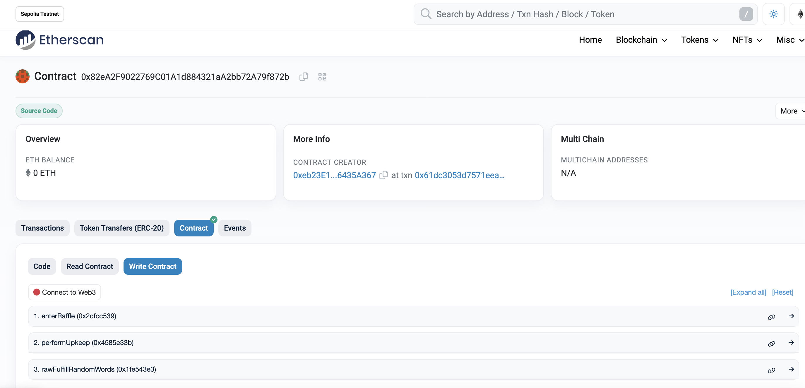

# Foundry Smart Contract Lottery



Contract CODE: https://sepolia.etherscan.io/address/0x82ea2f9022769c01a1d884321aa2bb72a79f872b#code

## Quickstart

```
git clone https://github.com/Solidityarchitect/foundry-lottery
cd foundry-lottery
forge build
```

# Usage

## Start a local node

```
make anvil
```

## Library

If you're having a hard time installing the chainlink library, you can optionally run this command.

```
forge install smartcontractkit/chainlink-brownie-contracts@0.6.1 --no-commit
```

## Deploy

This will default to your local node. You need to have it running in another terminal in order for it to deploy.

```
make deploy
```

## Deploy - Other Network

[See below](#deployment-to-a-testnet-or-mainnet)

## Testing

We talk about 4 test tiers in the video.

1. Unit
2. Integration
3. Forked
4. Staging

This repo we cover #1 and #3.

```
forge test
```

or

```
forge test --fork-url $SEPOLIA_RPC_URL
```

### Test Coverage

```
forge coverage
```

# Proveably Random Raffle Contracts

## About

This code is create a proveably random smart contract lottery.

## What we want it to do?

1. User can enter by paying for ticket
   1. The ticket fees are going to go to the winner during the draw
2. After X period of time, the lottery will automatically draw a winner
   1. And this will be done propramtically
3. Using Chainlink VRF & Chainlink Autimation
   1. Chainlink VRF -> Randomness
   2. Chainlink Automation -> Time base trigger

## Test

1. Write some deploy scripts
2. write our tests
   1. Work on a local chain
   2. Forked Testnet
   3. Forked Mainnet
